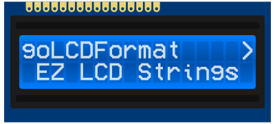

# goLCDFormat
A pure Go library that simplifies formatting strings for LCD and alphanumeric displays.


# Installation
```sh
go get https://github.com/pbxx/goLCDFormat
```

# Usage

### SpaceBetween:
```go
import "https://github.com/pbxx/goLCDFormat"

result := lcdformat.SpaceBetween(16, "Hello", "World")
// -> "Hello      World"
```

### Center:
```go
import "https://github.com/pbxx/goLCDFormat"

result := lcdformat.Center(width, "Test")
// -> "      Test      "
```
